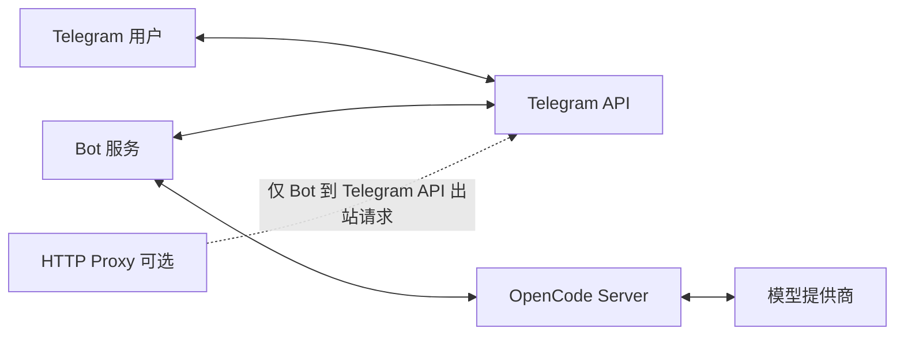

# OpenCode Telegram Bot

通过 Telegram 与 OpenCode Server 交互的机器人。

## 概览
- 通过聊天直接下达编程任务，实时查看处理中输出。
- 支持会话管理（创建、切换、查看当前会话）。
- 支持模型查看与切换。
- 支持中断任务、查看状态、浏览文件。

## 架构与部署


- Bot 和 OpenCode 不要求同机部署，只要网络互通即可。
- `proxy` 配置是 Bot 基础设施细节，Telegram 用户侧无感知。

## 快速开始
### 前置条件
1. 可用的 Telegram Bot Token。
2. Bot 所在机器可访问 Telegram API（直连或经可选代理）。
3. Bot 所在机器可访问 OpenCode Server（例如 `http://<opencode-host>:8080`）。
4. Go 1.21+。

### 配置
复制 `config.example.toml` 为 `config.toml`，至少修改以下字段：

```toml
[telegram]
token = "YOUR_BOT_TOKEN"
polling_timeout = 60
polling_limit = 100

[proxy]
enabled = false  # 只有 Bot 访问 Telegram API 受限时才设为 true
url = "http://127.0.0.1:7890"

[opencode]
url = "http://<opencode-host>:8080"
timeout = 300

[storage]
type = "file"
file_path = "bot-state.json"

[logging]
level = "info"
output = "bot.log"
```

### 启动
```bash
make build
./tg-bot --config ./config.toml
```

## 常用命令
- `/start` 初始化说明
- `/help` 查看帮助
- `/sessions` 查看会话列表
- `/new [name]` 新建会话
- `/switch <number>` 切换会话
- `/current` 查看当前会话
- `/status` 查看当前任务状态
- `/abort` 中断当前任务
- `/models` 按 provider 查看可用模型
- `/setmodel <number>` 设置当前会话模型
- `/files [path]` 浏览目录

发送任意非命令文本，即会转发给 OpenCode 处理。

## 常见问题
- 无法连接 OpenCode：确认 `opencode.url` 可达、服务正常。
- 无法连接 Telegram：确认 `telegram.token` 正确；若启用代理，确认 `proxy.url` 可达。
- 响应超时：适当增大 `opencode.timeout` 并检查 OpenCode 侧负载。
- 会话数据位置：默认保存在 `bot-state.json`。
