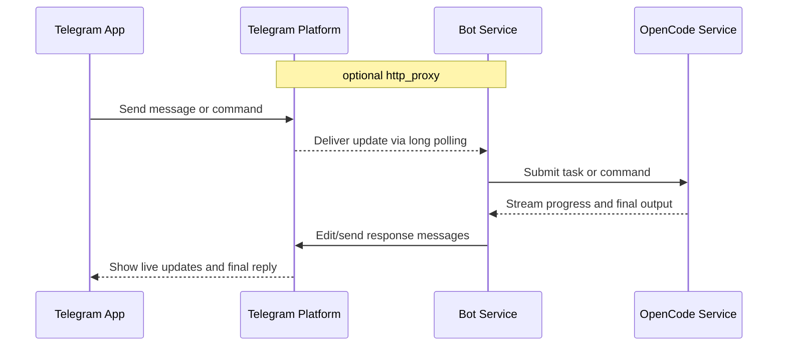

# OpenCode Telegram Bot

A Telegram bot for interacting with an [OpenCode](https://github.com/anomalyco/opencode) Server.

## Overview

- Send programming tasks in chat and receive real-time progress updates.
- Manage sessions (create, switch, inspect current session).
- View and switch available models.
- Abort tasks, check status, and browse files.

## Architecture and Deployment



- Bot and OpenCode do not need to run on the same machine.
- The `proxy` setting is an infrastructure detail on the bot side and is not user-visible.

## Quick Start

### Prerequisites

1. A valid Telegram Bot Token (open `@BotFather` in Telegram, run `/newbot`, then copy the token).
2. The bot host can access Telegram API (directly or through an optional proxy).
3. The bot host can access OpenCode Server (for example `http://<opencode-host>:<opencode-port>`).
4. Go 1.21+.

### Configuration

Copy `config.example.toml` to `config.toml`, then update at least these fields:

```toml
[telegram]
token = "YOUR_BOT_TOKEN"

[proxy]
enabled = false  # set true only when direct Telegram API access is blocked
url = "http://127.0.0.1:7890"

[opencode]
url = "http://<opencode-host>:<opencode-port>"
timeout = 300

[render]
mode = "markdown_stream"
```

`telegram.polling_timeout` and `telegram.polling_limit` are optional. Defaults are `60` and `100`.
`storage.type` and `storage.file_path` are optional. Defaults are `file` and `bot-state.json`.
`render.mode` is optional. Defaults to `markdown_stream` (`plain`, `markdown_final`, `markdown_stream`).
`logging.level` and `logging.output` are optional. Defaults are `info` and `bot.log`.

### Start OpenCode (hostname and port)

If OpenCode is not running yet, bind it to a specific hostname and port:

```bash
opencode serve --hostname 0.0.0.0 --port <opencode-port> --print-logs
```

For local-only access:

```bash
opencode serve --hostname 127.0.0.1 --port <opencode-port> --print-logs
```

Then set `opencode.url` in `config.toml` to the address reachable from the bot host.

### Run

```bash
make build
./tg-bot --config ./config.toml
```

## Common Commands

- `/start` show onboarding message
- `/help` show command help
- `/sessions` list sessions
- `/new [name]` create a new session
- `/switch <number>` switch session
- `/current` show current session
- `/status` show current task status
- `/abort` abort current task
- `/models` list available models grouped by provider
- `/setmodel <number>` set model for current session
- `/files [path]` browse files

Any non-command text message is forwarded to OpenCode.

## Troubleshooting

- Cannot connect to OpenCode: verify `opencode.url` and OpenCode service health.
- Cannot connect to Telegram: verify `telegram.token`; if proxy is enabled, verify `proxy.url`.
- Request timeout: increase `opencode.timeout` and check OpenCode server load.
- Session state file: defaults to `bot-state.json`.
