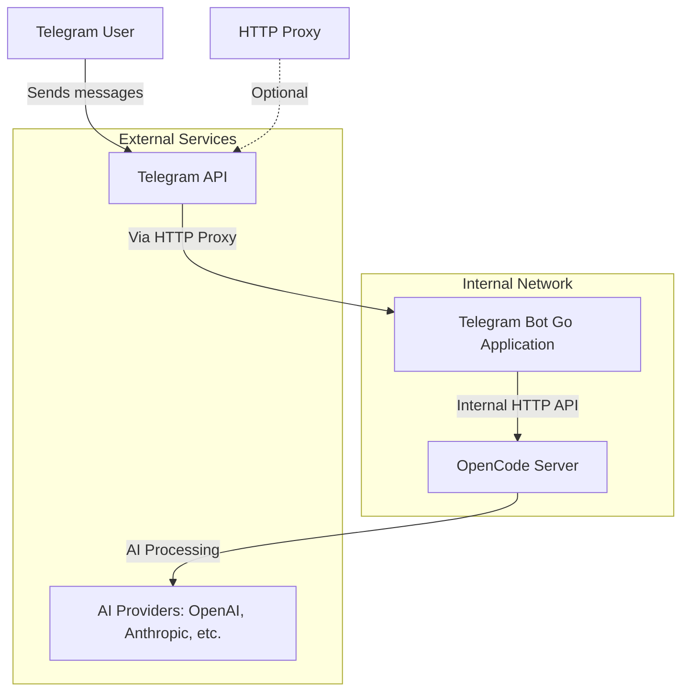

# OpenCode Telegram Bot

A Telegram bot for interacting with OpenCode AI programming assistant deployed in internal networks. The bot runs in internal network environments, accesses Telegram API via HTTP proxy, and uses polling to receive messages. It provides a CLI-like experience for users to interact with OpenCode through Telegram.

## Features

- ✅ Interact with OpenCode through Telegram Bot
- ✅ HTTP proxy support (for accessing external services)
- ✅ Polling mode (no public IP required)
- ✅ Session management (independent sessions per user)
- ✅ View task status and intermediate outputs
- ✅ Initiate programming tasks with streaming responses
- ✅ Abort running tasks
- ✅ File browsing and project exploration
- ✅ Model selection and AI provider management
- ✅ Real-time message updates and progress tracking

## System Architecture



**Simplified View:** `Telegram API <--[HTTP Proxy]--> Telegram Bot (Golang) <--[Internal HTTP]--> OpenCode Server`

## Quick Start

### Prerequisites

1. OpenCode server running at `http://192.168.50.100:8080` (or your OpenCode server URL)
2. HTTP proxy accessible to Telegram API (e.g., `http://127.0.0.1:7890`)
3. Telegram Bot Token (obtain from @BotFather)
4. Go 1.21+ development environment

### Configuration

Copy `config.example.toml` to `config.toml` and modify the settings:

```toml
[telegram]
token = "YOUR_BOT_TOKEN"
polling_timeout = 60
polling_limit = 100

[proxy]
enabled = true
url = "http://127.0.0.1:7890"

[opencode]
url = "http://192.168.50.100:8080"
timeout = 300  # Increased timeout for long-running tasks

[storage]
type = "memory"  # or "sqlite"
sqlite_path = "sessions.db"

[logging]
level = "info"
output = "bot.log"
```

### Build and Run

```bash
# Install dependencies
make deps

# Build the bot
make build

# Check OpenCode connection
make check-opencode

# Run the bot
make run
```

Or run directly:

```bash
go run cmd/bot/main.go
```

## Usage Guide

### Basic Commands

- `/start` - Show welcome message
- `/help` - Display help information
- `/sessions` - List all your sessions
- `/new [name]` - Create a new session
- `/switch <sessionID>` - Switch to a different session
- `/current` - Show current session information
- `/abort` - Abort current task
- `/status` - View current task status

### File Operations
- `/files [path]` - Browse project files (default: current directory)
- `/search <pattern>` - Search code text (if API available)
- `/findfile <pattern>` - Search for files (if API available)
- `/symbol <name>` - Search for symbols (if API available)

### AI Model Management
- `/models` - List available AI models with numeric IDs
- `/providers` - List AI providers and connection status
- `/setmodel <number>` - Set model for current session
- `/newmodel <name> <number>` - Create new session with specific model

### Interactive Mode

Send any non-command text, and the bot will send it as an instruction to OpenCode and stream back the response.

Example:
```
User: Write a Go function to calculate Fibonacci sequence
Bot: 🤖 Processing...
Bot: Here's a Go function to calculate Fibonacci sequence...
```

### Session Management

- Each Telegram user has one default session
- Use `/new` to create multiple sessions for different tasks
- Use `/switch` to switch between sessions
- Session state is stored in memory (lost on restart)

## Development

### Project Structure

```
tg-bot/
├── cmd/bot/main.go          # Application entry point
├── internal/
│   ├── config/              # Configuration management (TOML)
│   ├── handler/             # Telegram command handlers
│   ├── opencode/            # OpenCode API client
│   ├── session/             # Session manager
│   ├── stream/              # SSE streaming utilities
│   └── logging/             # Logging configuration
├── config.toml              # Configuration file
├── DESIGN.md                # Design documentation
└── docs/tg-coding.md        # Development notes
```

### Testing

```bash
# Run all tests
make test

# Run specific package tests
go test ./internal/config
go test ./internal/opencode
go test ./internal/session
```

### Adding New Commands

1. Register the command in `internal/handler/handlers.go`:
   ```go
   b.tgBot.Handle("/newcommand", b.handleNewCommand)
   ```

2. Implement the handler function:
   ```go
   func (b *Bot) handleNewCommand(c telebot.Context) error {
       // Handler logic
       return c.Send("Response")
   }
   ```

## Configuration Reference

### Telegram Configuration
- `token`: Telegram Bot Token (required)
- `polling_timeout`: Polling timeout in seconds
- `polling_limit`: Number of messages to fetch per poll

### Proxy Configuration
- `enabled`: Whether to enable proxy
- `url`: Proxy server URL

### OpenCode Configuration
- `url`: OpenCode server URL (required)
- `timeout`: API request timeout in seconds (increased to 300 for long tasks)

### Storage Configuration
- `type`: Storage type (`memory` or `sqlite`)
- `sqlite_path`: SQLite database path (when type=sqlite)

### Logging Configuration
- `level`: Log level (debug, info, warn, error)
- `output`: Log output file (stdout or file path)

## Current Implementation Status

### ✅ Implemented Features
- Full session management (create, list, switch sessions)
- Real-time message streaming with periodic updates
- File browsing (`/files` command)
- AI model and provider management
- Task status monitoring (`/status` command)
- Task abortion (`/abort` command)
- Message formatting optimization (removed redundant headers)
- Tool call display with JSON parsing
- Proxy support for Telegram API access
- Health checks and error handling

### ⚠️ Known Limitations
- Search APIs (`/search`, `/findfile`, `/symbol`) return "API not available" messages as OpenCode search endpoints return HTML instead of JSON
- Some advanced OpenCode features may not be available via API
- Session persistence is memory-only (optional SQLite support available)

### 🔧 Technical Details
- **Message Updates**: Uses 5-second periodic polling to update message status
- **Tool Call Display**: Attempts to parse JSON snapshots to show tool names and arguments
- **Timeout Handling**: Increased to 300 seconds to accommodate long-running tasks
- **Proxy Configuration**: Explicit proxy settings to avoid proxy interference with local OpenCode connections

## Troubleshooting

### OpenCode Connection Failure
```
ERROR: OpenCode health check failed
```
- Verify OpenCode server is running
- Check network connectivity
- Validate `opencode.url` configuration

### Telegram Connection Failure
```
ERROR: Failed to create Telegram bot
```
- Verify Bot Token is correct
- Check proxy configuration
- Ensure proxy server can access Telegram API

### Streaming Response Interruption
- Check if OpenCode SSE endpoint is working properly
- Review error messages in logs

### "context deadline exceeded" Errors
- Increase `timeout` in OpenCode configuration (currently 300 seconds)
- Check OpenCode server performance

## License

MIT License

## Contributing

Issues and Pull Requests are welcome.